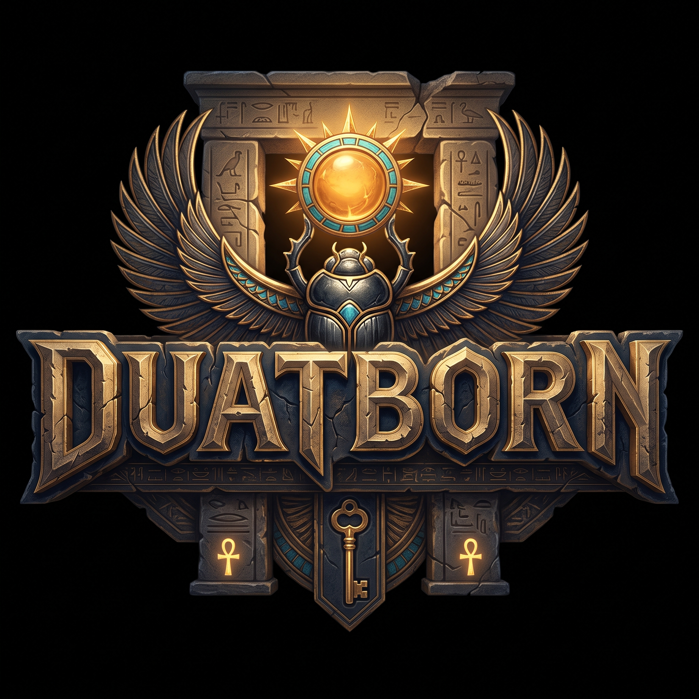

# DUATBORN



An original cooperative action roguelite prototype. Egyptian-inspired fantasy:
animal-shaped guardians descend through a fractured Duat and combine their rites
to reopen the sun's route and restore dawn. Isometric action combat, solo or
2-4 players, PC-first.

Historical working titles: "Rootbound: Fractured Realms", then "Dawnkeepers:
Gates of Duat". The repository, project folder, namespaces, and internal type
names retain the "Rootbound" name; only player-facing branding uses Duatborn.
See `docs/CREATIVE_DIRECTION.md`.

This repository currently contains **Milestone 3**: a host-authoritative
three-room run loop (Rootway → Blight Hollow → Heartwood finale) with between-room
upgrade pickups, a second enemy type (the Sporeling), and both offline (solo /
local co-op) and Photon Fusion online host/join play.

> Status: the project **compiles in Unity `6000.0.84f1` (arm64)** and the arena
> scene runs headlessly in Play Mode. Automated tests: **core 75/75, Unity
> EditMode 75/75, Unity PlayMode 11/11, all passing**. Photon Fusion 2.1.3 is
> imported and online Host Mode is manually validated. `v0.1.0` macOS (arm64)
> and Windows builds are published; the macOS player was smoke-tested headlessly.
> Real gamepad input, full standalone gameplay, and two-machine play remain
> unverified. See `docs/HANDOFF.md`.

**Native Windows is the primary development environment and the initial release
target; Mac M1 is secondary. WSL is optional tooling, not the Unity environment.**
See `docs/ENVIRONMENT.md`.

## Requirements

- Unity 6.0 LTS **`6000.0.84f1`** (pinned in `ProjectSettings/ProjectVersion.txt`).
  Unity 6.3 LTS `6000.3.25f1` is also a supported alternative.
- .NET SDK (for the pure-core test project only; verified with 10.0.300).
- Git. Keep the clone at a short path (e.g. `C:\dev\duatborn`) on Windows.

## Open the project

1. Install Unity Hub and Unity `6000.0.84f1`. (On this Mac, `6000.6.4f1` is also
   installed; the project stays on the pinned `6000.0.84f1`.)
2. In Unity Hub, **Add** this repository folder and open it. Unity resolves
   `Packages/manifest.json` (Input System 1.11.2; URP and Test Framework resolve
   to the editor-bundled 17.0.4 / 1.6.0 — see `docs/HANDOFF.md`).

## Configure and generate the arena (one step)

From the Unity menu bar run:

`Rootbound > Setup Project and Create Arena Scene`

This is idempotent and does all of the following:

- Creates and assigns the URP asset under `Assets/Rootbound/Settings/`
  (Graphics + Quality settings) and sets Active Input Handling to **Both**.
- Writes the definition assets (`Assets/Rootbound/Data/*.asset`).
- Creates `Assets/Rootbound/Scenes/CombatArena.unity` and adds it to Build Settings.

The individual menu items (`Configure URP and Input`, `Build Milestone 1 Content`,
`Create Arena Scene`) also exist. Re-running never overwrites authored values.

## Play the arena

1. Open `Assets/Rootbound/Scenes/CombatArena.unity`.
2. Press **Play**.
3. Pick a mode from the menu: **Play Solo**, **Host Co-op**, **Join Co-op**, or
   **Local Co-op**. Offline modes report `Session: Hosting LOCAL (offline/local)`.

Online host/join uses Photon Fusion 2.1.3 Host Mode (no prediction); a Photon App
ID must be configured locally. Install steps and App ID configuration are in
`docs/FUSION_SETUP.md` (Fusion 2.1.3, Unity 6.0.x supported).

## Controls

| Action | Player 1 (keyboard/mouse) | Player 2 (gamepad) |
| --- | --- | --- |
| Move | WASD | Left stick |
| Aim | Mouse position | Right stick |
| Primary | Left mouse | Right trigger |
| Special | Q / Right mouse | Left trigger |
| Dodge | Space | East / B |
| Restart | R (after clear/defeat) | R |

**Player 2 requires a gamepad** — there are no keyboard bindings for player 2.
Player 1 plays with keyboard/mouse (mouse aim). Local two-player therefore needs
one gamepad; two-player has not yet been tested with hardware.

Development-only helpers are **hidden by default**. Press **F1** to toggle the
diagnostics overlay (tick, elapsed sim time, timestep, `Time.timeScale`,
health/defeat, all cooldowns, dodge active/invulnerable, enemy attack cooldown,
and the last action's accepted/rejected reason). In the Editor a small aim
marker shows where an aimed special will land (orange when the cursor is out of
range and the target is clamped). Rejected actions briefly show their reason
next to the player HUD. None of this is drawn in release builds.

## Tests

Pure gameplay core (runs anywhere, no Unity required):

```
dotnet test Tools/CoreTests/CoreTests.csproj
```

Inside Unity: `Window > General > Test Runner`, then run the **EditMode** and
**PlayMode** suites. Last results on this Mac (Unity `6000.0.84f1`, headless):

- `dotnet test`: 75/75 passed.
- Unity EditMode: 75/75 passed.
- Unity PlayMode: 11/11 passed.

See `docs/TESTING.md` for exact commands and the manual checklist.

## Builds and releases

`v0.1.0` ships a Windows x64 build and an unsigned macOS Apple Silicon (arm64)
build on the [Releases page](https://github.com/yHugoSoares/duatborn/releases). GitHub Actions builds both targets
(see `docs/HANDOFF.md` CI section); tagged `v*` builds publish versioned archives
when Unity license secrets are configured or a self-hosted macOS runner is
registered.

## Repository layout

```
Assets/Rootbound/
  Scripts/Core/         Pure C# gameplay domain (no UnityEngine)
  Scripts/Runtime/      Unity adapters: input, runner, presentation, UI, networking
  Scripts/Editor/       Reproducible URP/input/content/scene generator
  Tests/EditMode/       NUnit tests (also run via dotnet)
  Tests/PlayMode/       PlayMode integration test
  Settings/             Generated URP assets
  Data/                 Generated ScriptableObject definitions
  Scenes/               Generated arena scene
Packages/               Unity package manifest and lock
ProjectSettings/        Pinned editor version
Tools/CoreTests/        dotnet test project for the pure core
docs/                   ARCHITECTURE, DECISIONS, TESTING, HANDOFF, PLAN, MILESTONE3_PLAN
```

## Non-goals for this milestone

Procedural generation, sanctuary, dialogue, bosses, inventory/crafting, public
matchmaking, host migration, cross-platform release work, and a large upgrade
catalogue are explicitly out of scope.

Duatborn is an original work. It draws on Egyptian-inspired imagery as fiction
but does not present invented lore as authentic belief and copies no assets,
characters, UI, dialogue, or implementation from existing games. The name is
final.
